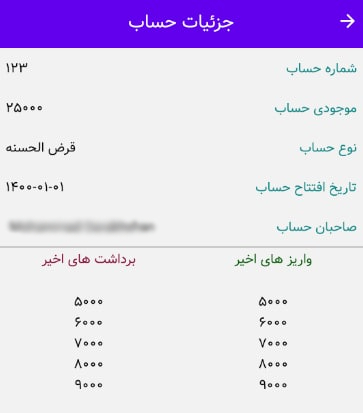

# Banker

banker is a banking system with security mechanisms implemented

## Requirements

- Python 3.9.5
- Django 3.2

## Installation

### Backend Installation

1. `cd backend`
2. `pip install -r requirements.txt`
3. `python manage.py collectstatic`
4. set your environment variables in .env file

## Usage

### Backend Usage

1. `python manage.py migrate`
2. `python manage.py runserver`

### Screenshots

#### 1st

#### 2nd

## Credits

Thank those who helped make this possible.
